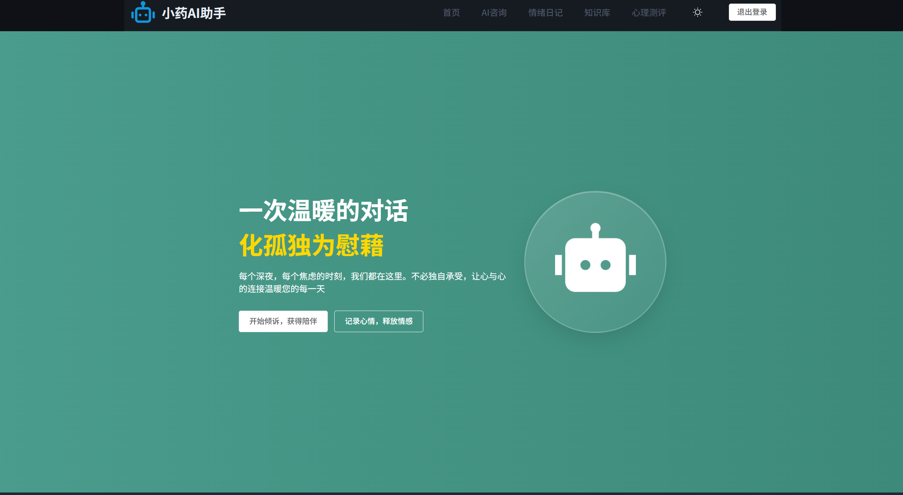
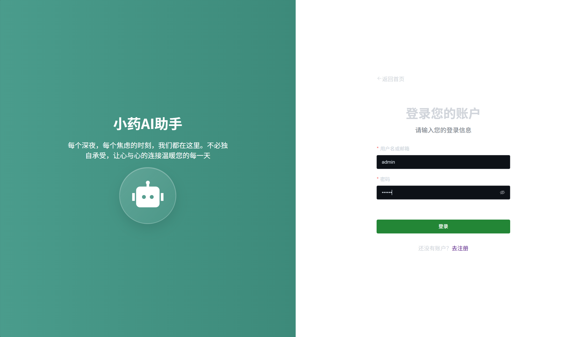
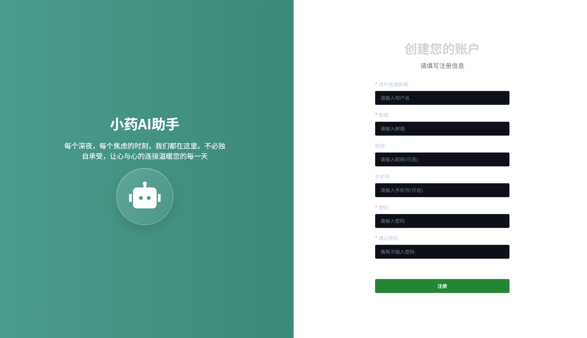
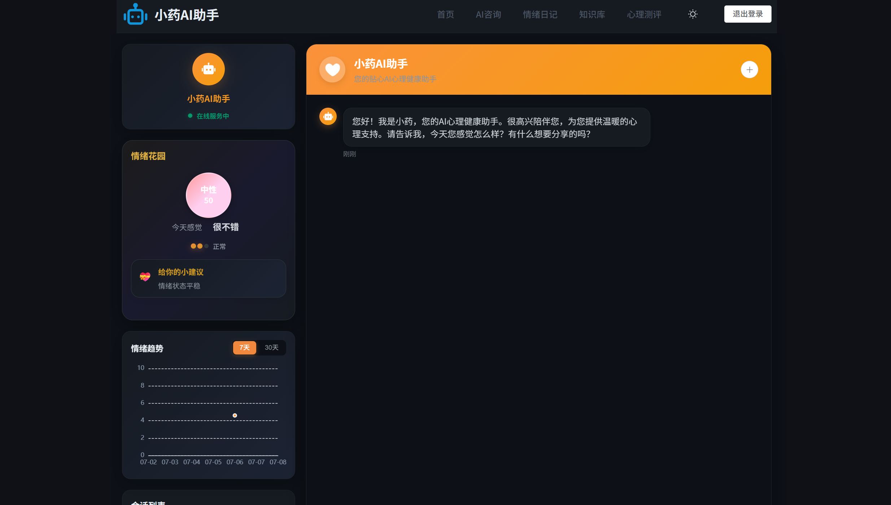
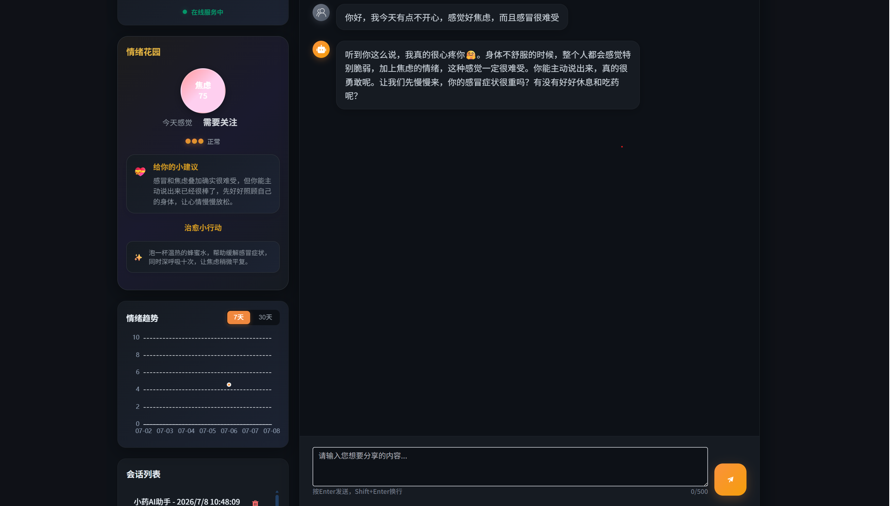
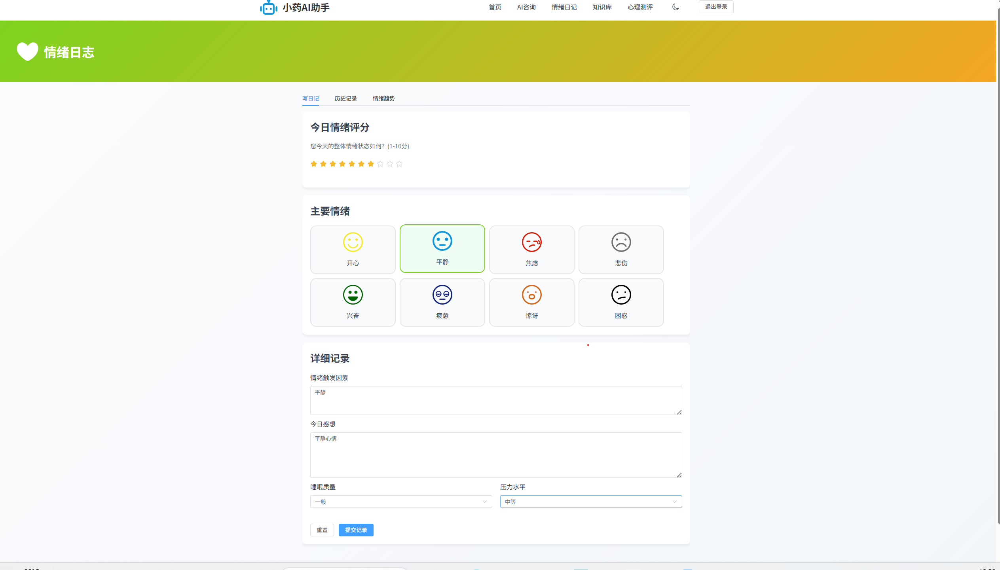
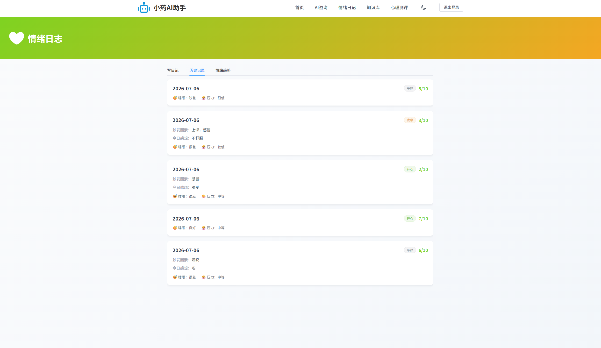
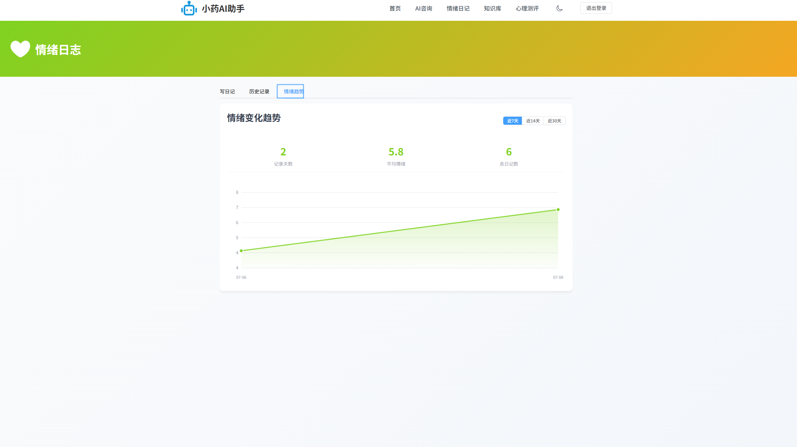
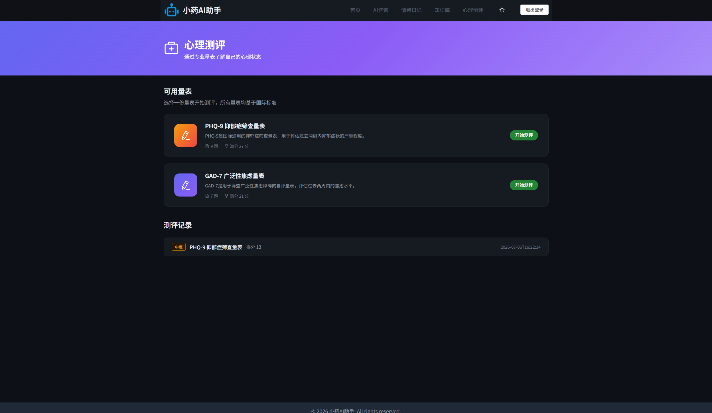

<div align="center">

# 🧠 小药AI心理助手

**一个温暖的AI心理健康咨询平台**

*让每一次倾诉都被温柔以待*

[](https://openjdk.org/)
[](https://spring.io/projects/spring-boot)
[](https://spring.io/projects/spring-ai)
[](https://vuejs.org/)
[](LICENSE)

</div>

---

## ✨ 项目简介

小药AI心理助手是一个基于大语言模型的智能心理咨询平台，为用户提供24小时在线心理支持。通过AI技术，让每个人都能随时获得专业、温暖的心理咨询服务。

**核心理念：** AI不是要替代专业心理咨询师，而是成为每个人触手可及的心理健康守护者。

---

## 🌟 功能亮点

| 功能模块 | 描述 |
|---------|------|
| 🤖 **AI智能咨询** | 基于大模型的心理咨询对话，流式响应，实时分析情绪状态 |
| 📝 **情绪日记** | 记录每日心情，AI自动分析情绪趋势，生成可视化报告 |
| 📊 **心理测评** | 专业心理量表测评，AI解读测评结果，提供个性化建议 |
| 📚 **知识库** | 心理健康知识文章，分类浏览，帮助用户自助学习 |
| 👥 **用户系统** | 注册登录、个人中心、历史记录管理 |

---

## 📸 效果展示

### 首页与登录

<div align="center">

&nbsp;&nbsp;

</div>

<div align="center">

</div>

### AI咨询核心功能

<div align="center">

&nbsp;&nbsp;

</div>

### 情绪日记与分析

<div align="center">

&nbsp;&nbsp;

</div>

<div align="center">

</div>

### 心理测评

<div align="center">

</div>

---

## 🛠️ 技术栈

### 后端技术

| 技术 | 版本 | 说明 |
|-----|------|------|
| Java | 25 | 编程语言 |
| Spring Boot | 4.1.0 | 后端框架 |
| Spring AI | 2.0 | AI集成框架 |
| MyBatis-Plus | - | ORM框架 |
| MySQL | 8.0+ | 关系型数据库 |
| Redis | 7.x | 缓存与会话管理 |
| JWT | - | 用户认证授权 |
| SSE | - | 流式响应支持 |

### 前端技术

| 技术 | 说明 |
|-----|------|
| Vue 3 | 前端框架 |
| Element Plus | UI组件库 |
| Axios | HTTP客户端 |
| Pinia | 状态管理 |
| ECharts | 数据可视化 |

### AI能力

| 功能 | 实现方式 |
|-----|---------|
| 心理咨询对话 | DeepSeek API + Prompt Engineering |
| 情绪分析 | AI自动识别对话情绪状态 |
| 测评解读 | AI分析量表结果生成报告 |
| 流式输出 | SSE实时流式响应 |

---

## 🚀 快速开始

### 环境要求

- JDK 25+
- Node.js 18+
- MySQL 8.0+
- Redis 7.x+
- Maven 3.9+

### 1. 克隆项目

```bash
git clone https://github.com/LuoYuan421/mental-health-assistant.git
cd mental-health-assistant
```

### 2. 配置环境变量

复制 `.env.example` 为 `.env` 并填写配置：

```bash
cp .env.example .env
```

编辑 `.env` 文件：

```env
# 数据库配置
DATABASE_URL=jdbc:mysql://localhost:3306/mental_health_assistant?useSSL=false&serverTimezone=UTC
DATABASE_USERNAME=root
DATABASE_PASSWORD=your_password

# AI配置（硅基流动平台）
AI_API_KEY=your_api_key
AI_BASE_URL=https://api.siliconflow.cn

# JWT配置
JWT_SECRET=your_jwt_secret
```

### 3. 初始化数据库

```bash
mysql -u root -p < init.sql
```

### 4. 启动后端

```bash
cd ai-springboot
mvn spring-boot:run
```

后端启动在 http://localhost:1236

### 5. 启动前端

```bash
cd ai-vue
npm install
npm run dev
```

前端启动在 http://localhost:5173

---

## 📁 项目结构

```
mental-health-assistant/
├── ai-springboot/              # Spring Boot后端
│   └── src/main/java/
│       └── org/example/aispingboot/
│           ├── AiService/       # AI服务层
│           ├── controller/      # 控制器
│           ├── entity/          # 实体类
│           ├── mapper/          # MyBatis Mapper
│           ├── service/         # 业务服务层
│           ├── config/          # 配置类
│           └── util/            # 工具类
├── ai-vue/                     # Vue前端
│   └── src/
│       ├── views/              # 页面组件
│       ├── components/         # 公共组件
│       ├── api/                # 接口封装
│       ├── stores/             # Pinia状态
│       └── router/             # 路由配置
├── docs/                       # 文档与截图
├── .env.example                # 环境变量模板
└── init.sql                    # 数据库初始化脚本
```

---

## 💡 核心功能实现

### 1. AI心理咨询对话

使用Spring AI集成DeepSeek大模型，通过Prompt Engineering定义AI心理咨询师角色：

```java
// 心理咨询Prompt模板
String systemPrompt = """
    你是一位专业的心理咨询师"小药"，擅长倾听和共情。
    你的回复应该：
    1. 温暖、有同理心
    2. 帮助用户梳理情绪
    3. 提供建设性建议
    4. 必要时建议寻求专业帮助
    """;
```

### 2. 流式响应（SSE）

使用Server-Sent Events实现打字机效果，提升用户体验：

```java
@GetMapping(value = "/chat/stream", produces = MediaType.TEXT_EVENT_STREAM_VALUE)
public SseEmitter streamChat(@RequestParam String message) {
    // 流式返回AI回复
}
```

### 3. 情绪分析

AI自动分析用户对话中的情绪状态，生成情绪报告：

- 分析对话内容识别情绪类型
- 记录情绪变化趋势
- 生成可视化情绪图表

---

## 📊 数据库设计

主要数据表：

| 表名 | 说明 |
|-----|------|
| user | 用户表 |
| emotion_diary | 情绪日记表 |
| consultation_session | 咨询会话表 |
| consultation_message | 对话消息表 |
| questionnaire | 心理测评问卷表 |
| questionnaire_record | 测评记录表 |
| knowledge_article | 知识库文章表 |

---

## ⚠️ 注意事项

1. **API密钥安全**：请勿将 `.env` 文件提交到Git仓库
2. **AI服务**：需要在 [硅基流动平台](https://siliconflow.cn) 注册获取API Key
3. **数据库**：确保MySQL服务已启动并创建相应数据库

---

## 🔮 后续计划

- [ ] 接入更多AI模型（GPT-4、Claude等）
- [ ] 添加AI语音咨询功能
- [ ] 实现咨询师预约系统
- [ ] 开发移动端App
- [ ] 添加社区互助功能

---

## 📄 许可证

本项目采用 [MIT License](LICENSE) 开源协议

---

<div align="center">

**如果这个项目对你有帮助，请给个 ⭐ Star 支持一下！**

Made with ❤️ by [LuoYuan421](https://github.com/LuoYuan421)

</div>
